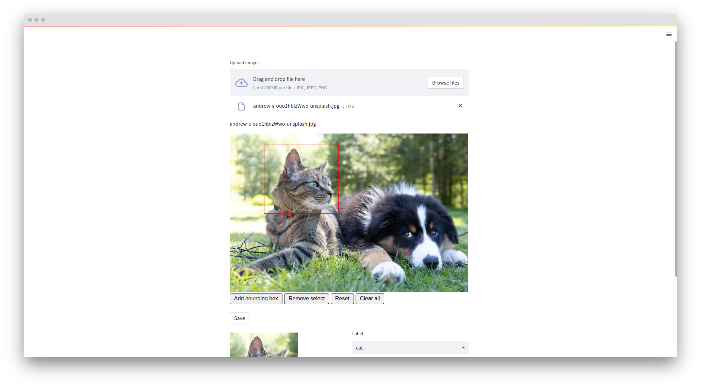

# Streamlit Image Labelling - COCO Format

streamlit-img-label is a graphical image annotation tool using streamlit. 

Annotations are saved as JSON files in COCO Dataset format.

**The biggest different is that we upload the image via streamlit NOT loading the images from the local dir. Use the image from users then save it into a json file.**

## Example
```sh
streamlit run app.py
```

## Demo


## Reference

- [streamlit-cropper](https://github.com/turner-anderson/streamlit-cropper)
- [streamlit-img-label](https://github.com/lit26/streamlit-img-label)
